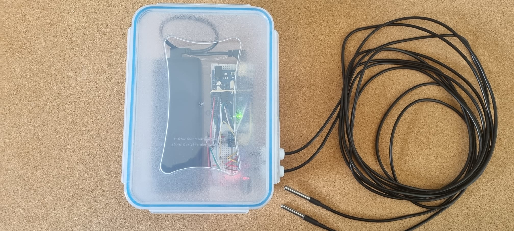
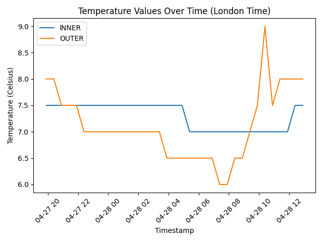

# Battery-Powered Multi-Thermometer with SD Card Data Logging and RTC

## Overview
This project introduces a battery-powered thermometer designed to monitor temperature consistently, recording data onto an SD card. Equipped with an RTC (Real-Time Clock) module, it ensures precise and uninterrupted time tracking, even when not connected to a power source.

The initial intent behind this project was to create a tool for consistent temperature monitoring during thermophilic composting. This process requires precise temperature control for specific time periods to achieve optimal results. The logged data serves the purpose of verifying the efficacy of the composting process and provides insights for potential enhancements. However, the tool's flexibility allows for its application in diverse scenarios beyond composting.

Detailed instructions on how to build for one yourself can be found in the [Setup Instructions](/media/manuals/"Setup_Instructions.md) document

## Code Description
The Arduino code for this project initializes the sensors, RTC module, SD card, and other components. It reads temperature data from DS18B20 sensors, timestamps it using the RTC module, and writes it to a CSV file on the SD card. The code includes functions for initializing the components, reading and writing data, and managing the RTC. 

The code contains several parameters that can be adjusted based on your use case, check out the [Customising the Code](media/manuals/Customising_the_Code.md) document to learn about these.

#### Plotting the Results
As the results are in CSV format it can easily be worked on in many applications, including Excel. However, the repo also contains a [Python script](/plot_temp_log.py) that plots the temperature logs on a time chart (python dependency installations are not included).

## Potential improvements 
- error catching/logging
- additional LED indicators
- a button for graceful start/stop
- incorporating a weather API to separately add outside temperature for the timestamp readings taken, so that it can be added to the time chart/analysis. 
- adding a solar panel for battery recharge during operation

## Author
Fahri Ulucay

## License
Free to use and distribute.

